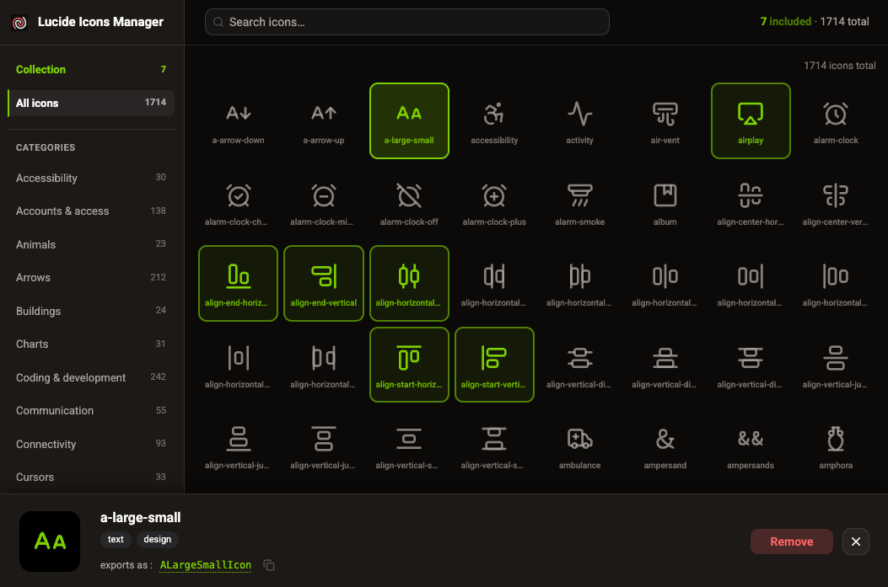

# 🎨 @finografic/lucide-manager

> A local developer tool for managing a [Lucide](https://lucide.dev) icon registry in a design system package.
> Browse all 1500+ Lucide icons in a fast picker UI and manage which icons are registered in your design system’s `icons.json`.

**This is a `devDependency` — not a runtime library.** It is installed in the host package (e.g. your design system) and launched from there. It is never imported or bundled into production code.



## How it works

The **host package** owns `icons.json` and serves it over a local **icons API** (typically Hono). **lucide-manager** provides the picker UI only — it reads and writes the registry through that API.

```
Host package                          lucide-manager (this package)
────────────────                      ─────────────────────────────
icons.json  ◀── icons API :3001 ────▶  Vite picker UI :5199
     │                                      (browse, search, toggle)
     └── host codegen (icons.ts, etc.)      not owned by lucide-manager
```

| Piece                         | Owner          | Description                                                        |
| ----------------------------- | -------------- | ------------------------------------------------------------------ |
| `icons.json`                  | Host           | Source of truth — which icons are included                         |
| Icons API (`/api/icons-json`) | Host           | `GET`/`POST` persistence for the registry                          |
| Picker UI                     | lucide-manager | React app launched via `lucide-manager` CLI                        |
| `icons.ts` / `index.ts`       | Host           | Generated from `icons.json` by host scripts (outside this package) |

---

## Installation

Install as a `devDependency` in your design system package:

```bash
# From your monorepo root, targeting the design system package:
pnpm add --filter @workspace/design-system --save-dev @finografic/lucide-manager

# Or from within the design system package directly:
pnpm add -D @finografic/lucide-manager
```

---

## Configuration

Configuration uses two JSON files with the **same schema** (see [`lucide-manager.config.schema.json`](./lucide-manager.config.schema.json)):

| File                           | Location                                    | Purpose                                    |
| ------------------------------ | ------------------------------------------- | ------------------------------------------ |
| `lucide-manager.defaults.json` | Shipped inside `@finografic/lucide-manager` | Package defaults                           |
| `lucide-manager.config.json`   | Host package root                           | Host overrides (merged on top of defaults) |

At runtime: `{ ...packageDefaults, ...hostConfig, ...envOverrides }`.

> **Keep schema and TypeScript in sync.** The canonical JSON Schema is `lucide-manager.config.schema.json`. The runtime interface is `LucideManagerConfig` in [`src/config/lucide-manager.config.types.ts`](./src/config/lucide-manager.config.types.ts). TypeScript does **not** infer types from JSON Schema automatically — update **both** when you add or rename a field. Optional codegen (`json-schema-to-typescript`) is possible but not used here.

### Two servers (different ports, different owners)

| Config path                       | Typical port | Owner              | Role                                              |
| --------------------------------- | ------------ | ------------------ | ------------------------------------------------- |
| `iconsApi.host` + `iconsApi.port` | 3001         | **Host package**   | Icons API (Hono) — `GET`/`POST` `/api/icons-json` |
| `manager.server.port`             | 5199         | **lucide-manager** | Picker UI Vite dev server                         |

At runtime the picker builds `http://${iconsApi.host}:${iconsApi.port}` for API calls.

### 1. Create `lucide-manager.config.json`

Place this file in your **host package root** (alongside its `package.json`). **All fields are required** — the file documents the full host setup and validates against the schema.

```json
{
  "$schema": "./node_modules/@finografic/lucide-manager/lucide-manager.config.schema.json",
  "iconsApi": {
    "host": "localhost",
    "port": 3001
  },
  "manager": {
    "server": {
      "port": 5199,
      "openOnStart": true
    },
    "appBranding": {
      "title": "Lucide Manager",
      "img": "/lucide.png",
      "showInSidebar": true
    }
  }
}
```

| Path                         | Description                                           |
| ---------------------------- | ----------------------------------------------------- |
| `iconsApi.host`              | Hostname of the host icons API (no `http://` prefix). |
| `iconsApi.port`              | Port of the host icons API server.                    |
| `manager.server.port`        | Port for the lucide-manager Vite picker UI.           |
| `manager.server.openOnStart` | Open the browser when the picker dev server starts.   |

Optional **`manager.appBranding`** (omit to use package defaults). When present, all nested fields are required:

| Path                                | Description                                      |
| ----------------------------------- | ------------------------------------------------ |
| `manager.appBranding.title`         | Sidebar / document title.                        |
| `manager.appBranding.img`           | Logo URL or root-relative path.                  |
| `manager.appBranding.showInSidebar` | Show or hide logo + title in the sidebar chrome. |

```json
"manager": {
  "server": { "port": 5199, "openOnStart": true },
  "appBranding": {
    "title": "My Design System Icons",
    "img": "/brand/icon.svg",
    "showInSidebar": false
  }
}
```

The `manager` block holds all lucide-manager settings (`additionalProperties: true` in the schema for future fields).

Copy [`lucide-manager.config.example.json`](./lucide-manager.config.example.json) as a starting point. Its `$schema` uses the **host install path** (`node_modules/@finografic/lucide-manager/...`) on purpose. In this repo, `pnpm install` links the package to itself as a devDependency so that path resolves and IDE validation works without changing the example.

Host values override package defaults from `lucide-manager.defaults.json`. You may repeat every field explicitly even when unchanged.

### 2. Add scripts to `package.json`

Your host package needs **both** the icons API server and the picker. Exact script names vary; a typical setup:

```json
{
  "scripts": {
    "icons:server": "your-icons-api-start-command",
    "icons": "lucide-manager",
    "generate:icons": "your-host-codegen-command"
  }
}
```

Start the icons API before (or alongside) the picker. The picker calls `http://${iconsApi.host}:${iconsApi.port}/api/icons-json`.

CLI flags: `--no-open` / `--open` override `manager.server.openOnStart` for a single run (via `LUCIDE_MANAGER_OPEN`).

### 3. Seed `icons.json`

Create the initial `icons.json` in the location your **host icons API** reads/writes. The shape is an array of entries:

```json
[
  { "lucideName": "arrow-up", "exportName": "ArrowUp" },
  { "lucideName": "chevron-down", "exportName": "ChevronDown" },
  { "lucideName": "x", "exportName": "Close" }
]
```

| Field        | Description                                                                                                                                                                                                   |
| ------------ | ------------------------------------------------------------------------------------------------------------------------------------------------------------------------------------------------------------- |
| `lucideName` | Kebab-case name as Lucide uses it (e.g. `"arrow-up"`)                                                                                                                                                         |
| `exportName` | PascalCase name without the `Icon` suffix (e.g. `"ArrowUp"`). Normally derived automatically from `lucideName`, but can be overridden — useful when you want a semantic name like `"Close"` instead of `"X"`. |

---

## Usage

All commands are run from the **host package root** (the directory containing `lucide-manager.config.json`).

### Open the icon picker

```bash
# 1. Start the host icons API (if not already running)
pnpm icons:server

# 2. Launch the picker (opens manager.server.port, default 5199)
pnpm icons
```

The picker fetches all Lucide icon metadata from the public Lucide API on startup (cached for 24 hours). Browse by category, search by name, and click any icon to open its detail panel. Use the **Add / Remove** button to toggle it in or out of your registry.

**Interactions:** single-click focuses an icon and opens the footer; double-click, **Space** (when the grid has focus), and the footer **Add / Remove** button all toggle inclusion.

Selections are saved automatically to `icons.json` through the host icons API — no manual save step.

### Regenerate TypeScript (host)

After editing the registry, run your host’s codegen script (not part of this package), then rebuild the design system:

```bash
pnpm generate:icons
pnpm build
```

### Typical workflow

```bash
pnpm icons:server    # terminal 1 — host icons API
pnpm icons           # terminal 2 — picker UI

# After closing the picker:
pnpm generate:icons  # host-owned codegen
pnpm build
```

---

## Generated file format (host)

If your host generates registry files from `icons.json`, they typically look like this. **This package does not run codegen** — shown for reference only.

### `icons.ts` (example with 3 icons)

```ts
/**
 * Icon Registry — @workspace/design-system
 *
 * !! GENERATED FILE — do not edit by hand.
 * !! Edit icons.json via the lucide-manager picker, then run: lucide-manager generate
 */

import * as Lucide from 'lucide-react';
import { createIconWrapper } from './icons.utils';

const ICONS = {
  ArrowUpIcon: Lucide.ArrowUp,
  CloseIcon: Lucide.X,
  ChevronDownIcon: Lucide.ChevronDown,
} as const;

// ... wrapped exports, public API
export const icons = wrappedIcons;
export type IconName = keyof typeof ICONS;
export const ICON_NAMES = (Object.keys(ICONS) as IconName[]).sort();
export type IconComponent = ReturnType<typeof createIconWrapper>;
```

### `index.ts` (named exports)

```ts
export type { IconComponent, IconName } from './icons';
export { ICON_NAMES, icons } from './icons';

export const { ArrowUpIcon, ChevronDownIcon, CloseIcon } = icons;

export type { IconProps } from './icons.utils';
export { createIconWrapper } from './icons.utils';
```

---

## Development

These instructions are for working on `lucide-manager` itself.

### Setup

```bash
pnpm install
```

### Run the picker locally

```bash
pnpm dev
```

When run from this package’s own root, config uses **package defaults** only (`lucide-manager.defaults.json`) — no host `lucide-manager.config.json` is required. You still need a icons API listening at the configured `iconsApi` URL (default `http://localhost:3001`) for registry load/save to work.

For full host-style testing, add `lucide-manager.config.json` in a parent directory or run from a consuming package with `LUCIDE_MANAGER_HOST_CWD` set.

### Scripts

```bash
pnpm dev             # Vite picker (package defaults config)
pnpm build           # Production bundle (dist/ — gitignored)
pnpm typecheck       # TypeScript (no emit)
pnpm lint            # oxlint
pnpm lint:fix        # oxlint with fixes
pnpm format:check    # oxfmt check
pnpm format:fix      # oxfmt write
pnpm test:run        # Vitest once
pnpm test            # Vitest watch
```

### Project structure

```
bin/
  lucide-manager.js              CLI shim — spawns Vite with LUCIDE_MANAGER_HOST_CWD
lucide-manager.defaults.json     Package default config (shipped in npm files)
lucide-manager.config.schema.json
lucide-manager.config.example.json
public/
  lucide.png                     Default appBranding logo
src/
  config/
    load-config.utils.ts         Merge defaults + host config + env
    lucide-manager.config.types.ts
    defaults.constants.ts        Filenames + icon size constants
    app-chrome.constants.ts      Shared h-14 sidebar/header chrome
    colors.constants.ts          Theme token aliases for picker states
  components/
    CategorySidebar.tsx          Sidebar branding + category filter
    IconCard.tsx                 Grid cell
    IconDetail.tsx               Footer detail panel
    IconSvg.tsx                  SVG from Lucide node trees
    ui/                          shadcn components (generated)
  hooks/
    useIconsJson.ts              Registry state via host icons API
    useLucideData.ts             Lucide public API metadata
  App.tsx                        Shell layout
  main.tsx                       React entry
  index.css                      shadcn theme tokens
vite.config.ts                   loadConfig(), define globals, dev server port
icons.json                       Sample registry (not used at runtime by picker)
```

---

## License

MIT © [Justin Rankin](https://github.com/finografic)
